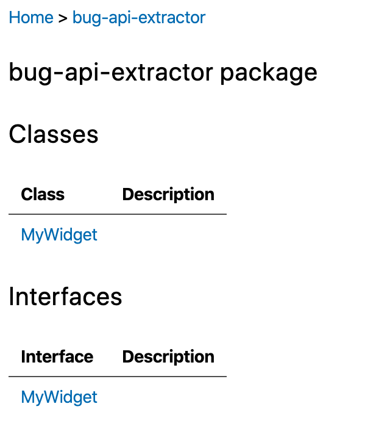
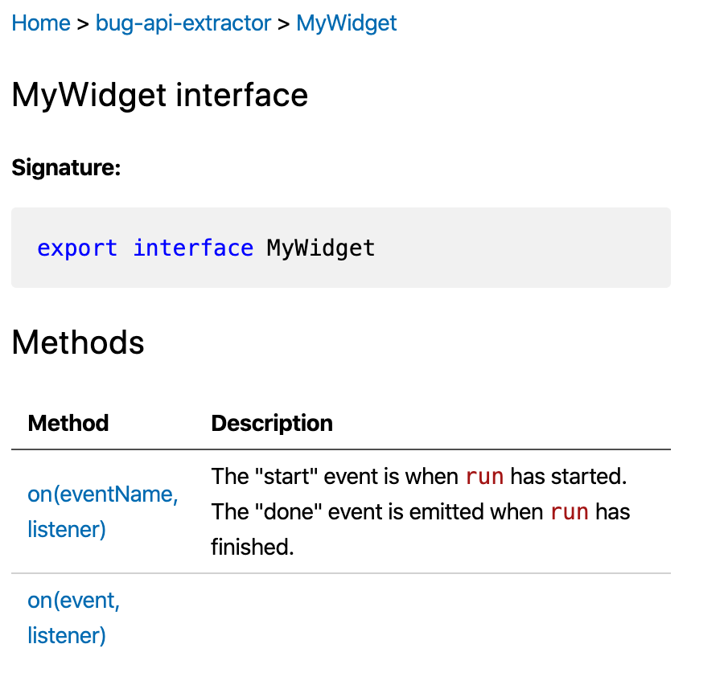

Consider [code](./src/index.ts) that defines both a class and an interface with
the same name. This approach is the recommended - if not the only - way how to
describe events emitted by subclasses of Node.js `EventEmitter`, as explained
on [StackOverflow](https://stackoverflow.com/q/39142858/69868).

```ts
export class MyWidget extends EventEmitter {
  // class implementation goes here
}

export interface MyWidget {
  // `on()` and `once()` declarations for MyWidget events
}
```

The package `api-extractor` recognizes both artifact types and emits a class and
an interface entry in the `.api.json` file.

```json
{
  // ...
  "members": [
    {
      "kind": "Class",
      "name": "MyWidget"
      // ...
    },
    {
      "kind": "Interface",
      "name": "MyWidget"
      // ...
    }
  ]
}
```

When rendered using `api-documenter`, the [index file](./apidocs/bug-api-extractor.md) shows two entries:



Both entries point to the same page [mywidget.md](apidocs/bug-api-extractor.mywidget.md). This page describes only interface members, ignoring the members implemented by the class.


